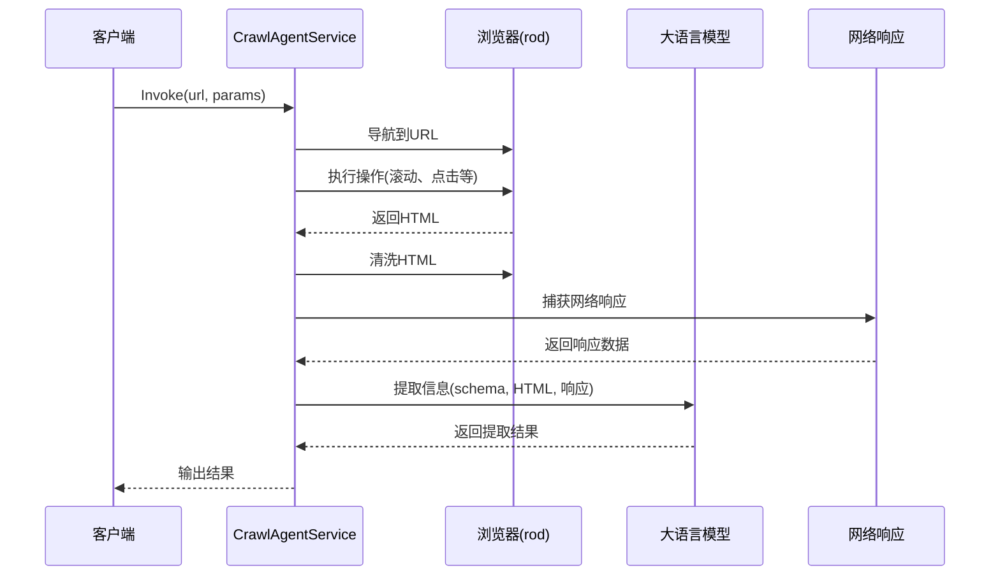
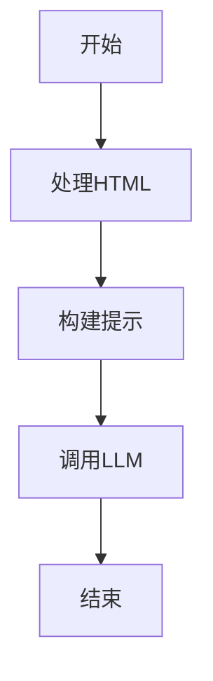

# CrawlerAgent-v2

CrawlerAgent-v2 是一个基于 AI 的网页爬虫代理库，为尝试智能信息提取和网页内容处理而设计。它结合了浏览器自动化、网络响应监听和大语言模型（LLM）技术，提供了一种高效、灵活的网页数据采集和处理解决方案。

## 项目特点

- **AI 驱动的信息提取**：集成大语言模型，根据自定义 schema 智能提取网页信息
- **AI 信息搜索**：利用 LLM 对持久化信息进行智能搜索
- **强大的浏览器自动化**：基于 Rod 库实现完整的浏览器控制，支持点击、滚动等操作
- **网络响应监听**：实时捕获和分析特定 URL 模式的网络响应
- **智能 HTML 处理**：自动识别和提取网页主要内容，支持标签过滤和清洗
- **高度可配置**：提供丰富的配置选项，适应不同的爬取场景
- **模块化设计**：清晰的组件分离，易于扩展和维护
- **多入口支持**：提供命令行工具、搜索代理等多种使用方式

## 目录结构

```
crawleragent-v2/
├── backend/
│   ├── cmd/                # 命令行入口
│   │   ├── crawlagent/     # 爬虫代理主程序
│   │   ├── searchagent/    # 搜索代理
│   │   ├── crawler/        # 基础爬虫
│   │   └── gui/            # 图形界面
│   ├── internal/           # 内部实现
│   │   ├── config/         # 配置管理
│   │   ├── controller/     # 控制器
│   │   ├── data/           # 数据模型
│   │   ├── infra/          # 基础设施
│   │   │   ├── crawler/    # 爬虫实现
│   │   │   ├── embedding/  # 嵌入模型
│   │   │   ├── llm/        # 语言模型
│   │   │   └── persistence/# 持久化
│   │   ├── middleware/     # 中间件
│   │   └── service/        # 服务层
│   ├── param/              # 参数定义
│   ├── types/              # 类型定义
│   └── utils/              # 工具函数
└── .gitignore
```

## 核心组件

### 1. CrawlAgentService

爬虫代理服务是整个系统的核心，负责协调浏览器操作、HTML 处理和 LLM 信息提取。

- **主要功能**：
  - 初始化和管理爬虫工作流
  - 执行网页导航和操作
  - 处理 HTML 内容和网络响应
  - 调用 LLM 进行信息提取
  - 支持流式和非流式输出

### 2. AICrawler

基于 Rod 库的 AI 爬虫实现，提供浏览器自动化和 HTML 处理功能。

- **主要功能**：
  - 浏览器启动和管理
  - 网页导航和等待
  - HTML 获取和清洗
  - 执行用户操作（点击、滚动等）
  - 网络响应监听

### 3. LLM 集成

集成大语言模型，用于智能信息提取和处理。

- **支持的模型**：
  - Ollama 本地模型
  - 可扩展支持其他 LLM 服务

### 4. 配置系统

灵活的配置系统，支持多种配置选项。

- **主要配置项**：
  - 浏览器设置（无头模式、用户代理等）
  - LLM 配置（主机、端口、模型等）
  - 嵌入模型配置
  - Elasticsearch 配置（可选）

## 快速开始

### 前置要求

- Go 1.20+
- 浏览器（Chrome 或基于 Chromium 的浏览器）
- LLM 服务（如 Ollama）

### 安装

```bash
go get github.com/yourusername/crawleragent-v2
```

### 基本使用

```go
package main

import (
	"context"
	"crawleragent-v2/internal/config"
	"crawleragent-v2/internal/infra/crawler/ai"
	"crawleragent-v2/internal/infra/llm"
	"crawleragent-v2/internal/service/crawlagent"
	"crawleragent-v2/param"
	"log"
	"time"

	"github.com/cloudwego/eino/components/prompt"
	"github.com/cloudwego/eino/schema"
)

func main() {
	// 初始化配置
	cfg, err := config.InitConfig()
	if err != nil {
		log.Fatalf("解析配置文件失败: %v", err)
	}

	// 初始化浏览器爬虫
	crawler, err := ai.InitAICrawler(cfg)
	if err != nil {
		log.Fatalf("初始化浏览器池失败: %v", err)
	}

	ctx := context.Background()

	// 初始化LLM
	llm, err := llm.InitLLM(ctx, cfg)
	if err != nil {
		log.Fatalf("初始化LLM失败: %v", err)
	}

	// 创建提示模板
	prompt := prompt.FromMessages(
		schema.FString,
		schema.SystemMessage(`角色:你是一位信息提取工具,负责从HTML中提取信息并根据json风格的schema中的定义进行格式化。`),
		schema.SystemMessage(`输入schema:\n{schema}`),
		schema.SystemMessage(`以下是处理后的HTML:\n{cleanedHTML}\n\n搜寻其中的内容并将内容填入schema中,如果HTML中没有相关内容,忽略该字段。`),
		schema.SystemMessage(`以下是监听的Json结果:\n{networkResponses}\n\n搜寻其中的内容并将内容填入schema中,如果Json中没有相关内容,忽略该字段。`),
	)

	// 初始化爬虫代理服务
	agent, err := service.InitCrawlAgentService(ctx, llm, crawler, prompt)
	if err != nil {
		log.Fatalf("初始化CrawlAgent失败: %v", err)
	}

	// 示例1: 提取博客摘要
	agent.Invoke(ctx, "https://www.cnblogs.com/", param.AICrawlerParam{
		Formats: param.Formats{
			Schema: param.Schema{
				Type: "array",
				Properties: map[string]param.Schema{
					"summary": {
						Type:        "string",
						Description: "博客的摘要",
					},
				},
			},
		},
		HTMLConfig: &param.AIHTMLConfig{
			OnlyMainContent: true,
			IncludeTags:     []string{"p"},
		},
	})

	// 示例2: 提取视频标题并执行滚动操作
	agent.Invoke(ctx, "https://www.bilibili.com/", param.AICrawlerParam{
		Formats: param.Formats{
			Schema: param.Schema{
				Type: "array",
				Properties: map[string]param.Schema{
					"title": {
						Type:        "string",
						Description: "视频的标题",
					},
				},
			},
		},
		NetworkConfig: &param.AINetworkConfig{
			URLPatterns:  []string{"https://api.bilibili.com/x/web-interface/index/ogv/rcmd*"},
			RespChanSize: 100,
		},
		Actions: []param.Action{
			&param.ScrollAction{
				BaseParams: param.BaseParams{
					Delay: 1000 * time.Millisecond,
				},
				ScrollY: 1000,
			},
			&param.ScrollAction{
				BaseParams: param.BaseParams{
					Delay: 1000 * time.Millisecond,
				},
				ScrollY: 1500,
			},
		},
	})

	// 关闭浏览器
	crawler.CloseAll()
}
```

## 高级功能

### 1. 网络响应监听

捕获特定 URL 模式的网络响应，用于提取 API 数据。

```go
// 在参数中配置网络响应监听
NetworkConfig: &param.AINetworkConfig{
    URLPatterns:  []string{"https://api.example.com/*"},
    RespChanSize: 100,
}
```

### 2. 自定义操作序列

执行一系列浏览器操作，如点击、滚动等。

```go
Actions: []param.Action{
    &param.ClickAction{
        BaseParams: param.BaseParams{
            Delay: 500 * time.Millisecond,
        },
        Selector: "#load-more",
    },
    &param.ScrollAction{
        BaseParams: param.BaseParams{
            Delay: 1000 * time.Millisecond,
        },
        ScrollY: 2000,
    },
}
```

### 3. HTML 清洗和过滤

智能识别和提取网页主要内容，支持标签过滤。

```go
HTMLConfig: &param.AIHTMLConfig{
    OnlyMainContent: true,
    IncludeTags:     []string{"div", "p", "h1", "h2"},
    ExcludeTags:     []string{"script", "style"},
}
```

### 4. 流式输出

支持流式输出结果，适用于实时处理。

```go	agent.Stream(ctx, "https://example.com", params)
```

## 配置说明

### 配置文件结构

```yaml
# 浏览器配置
rod:
  user_data_dir: "./user_data"
  headless: true
  user_agent: "Mozilla/5.0 (...)"
  # 其他浏览器配置...

# LLM配置
llm:
  host: "localhost"
  port: 11434
  model: "llama2"

# 嵌入模型配置
embedding:
  host: "localhost"
  port: 11434
  model: "nomic-embed-text"

# Elasticsearch配置（可选）
elasticsearch:
  host: "localhost"
  port: 9200
  username: "elastic"
  password: "changeme"
```

## 技术架构

### 核心流程图



### 工作流编排

使用 CloudWeGo Eino 进行工作流编排，实现组件间的高效协作。



## 应用场景

- **信息提取**：从网页中提取结构化信息
- **数据采集**：批量采集网页数据
- **内容监控**：监控网页内容变化
- **API 数据捕获**：捕获和分析网络 API 响应
- **自动化测试**：模拟用户操作进行测试

## 性能优化

- **浏览器复用**：避免频繁启动和关闭浏览器
- **并行处理**：支持并行爬取多个网页
- **HTML 清洗**：减少传递给 LLM 的数据量
- **网络响应过滤**：只捕获需要的网络响应

## 贡献指南

欢迎贡献代码、报告问题或提出建议！


## 许可证

本项目采用 MIT 许可证 - 详情请参阅 [LICENSE](LICENSE) 文件

## 联系方式

- 项目地址：https://github.com/yourusername/crawleragent-v2
- 问题反馈：https://github.com/yourusername/crawleragent-v2/issues
